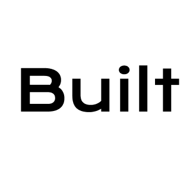

# Built - AI-Powered Web Design Tool



**Built** es una herramienta de diseño web potenciada por IA que te permite crear diseños HTML/CSS simplemente describiendo lo que querés.

## 🚀 Características

- ✨ **Diseño con IA**: Describí tu idea en español o inglés y obtené código listo para usar
- 🎨 **Preview en tiempo real**: Ve tu diseño inmediatamente después de generarlo
- 📱 **Responsive**: Los diseños se adaptan a todos los dispositivos
- ⚡ **Rápido**: Alimentado por Groq para respuestas instantáneas
- 🔒 **Seguro**: Tu privacidad es nuestra prioridad

## 🛠️ Tech Stack

- **Framework**: Next.js 14 (App Router)
- **Lenguaje**: TypeScript
- **UI Components**: shadcn/ui + Tailwind CSS
- **AI Engine**: Groq (Llama-3)
- **Deployment**: Vercel-ready

## 📁 Estructura del Proyecto

```
built/
├── app/
│   ├── page.tsx              # Landing page
│   ├── designer/
│   │   └── page.tsx          # Herramienta de diseño IA
│   ├── preview/
│   │   └── page.tsx          # Preview de diseños
│   ├── api/
│   │   └── generate/
│   │       └── route.ts      # API route para Groq
│   ├── layout.tsx
│   └── globals.css
├── components/
│   ├── ui/                   # Componentes shadcn
│   ├── layout/               # Header, Footer, Sidebar
│   └── designer/             # Componentes del diseñador
├── lib/
│   ├── groq.ts              # Cliente de Groq
│   └── utils.ts             # Utilidades
├── public/
│   ├── icon.png
│   └── icon.svg
└── README.md
```

## 🚀 Empezar

### Prerequisites

- Node.js 18+
- npm / pnpm / yarn

### Instalación

```bash
# Clonar el repositorio
git clone https://github.com/tu-usuario/built.git
cd built

# Instalar dependencias
npm install

# Iniciar el servidor de desarrollo
npm run dev
```

Abre [http://localhost:3000](http://localhost:3000) en tu navegador.

### Variables de Entorno

Creá un archivo `.env.local` en la raíz del proyecto:

```env
GROQ_API_KEY=tu_api_key_de_groq
```

Obtén tu API key de [console.groq.com](https://console.groq.com/keys)

## 🎨 Uso

1. **Landing**: Visitá la página principal para conocer Built
2. **Diseñador**: Andá a `/designer` para empezar a diseñar
3. **Describí**: Escribí tu idea en el campo de texto
4. **Generá**: Hacé click en "Generar" y esperá el código
5. **Previsualizá**: Ve tu diseño en tiempo real
6. **Exportá**: Copiá el código HTML/CSS

## ⚡ API

### POST /api/generate

Genera código HTML/CSS a partir de un prompt.

**Request:**
```json
{
  "prompt": "Un landing page para una startup de fintech con colores azul y blanco"
}
```

**Response:**
```json
{
  "code": "<!DOCTYPE html>...",
  "css": ".container { ... }"
}
```

## 🔧 Scripts Disponibles

- `npm run dev` - Servidor de desarrollo
- `npm run build` - Build de producción
- `npm run start` - Iniciar servidor de producción
- `npm run lint` - Linting con ESLint

## 📦 Dependencias Principales

- `next` - Framework React
- `react` / `react-dom` - Librería de UI
- `typescript` - Type safety
- `tailwindcss` - Utilidades CSS
- `@groq/sdk` - Cliente de Groq AI

## 🤝 Contribuir

Las contribuciones son bienvenidas. Por favor, abri un issue primero para discutir los cambios que te gustaría hacer.

## 📄 Licencia

MIT License - ver archivo [LICENSE](LICENSE) para más detalles.

## 👨‍💻 Autor

Tu Nombre - [@tu-twitter](https://twitter.com/tu-twitter)

---

Hecho con ❤️ usando Next.js, TypeScript y Groq AI
